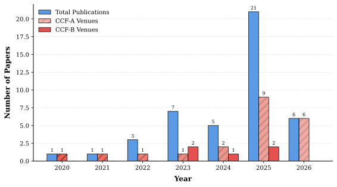

# 😎 Awesome Multi-Modal Object Re-Identification

[](https://awesome.re)
[](https://github.com/924973292/Awesome-Multi-Modal-Object-Re-Identification/graphs/commit-activity)
[](http://makeapullrequest.com)
[](https://opensource.org/licenses/MIT)

> A curated list of state-of-the-art methods, datasets, and resources for **Multi-Modal Object Re-Identification (MM-ReID)**. This repository tracks the latest advancements in utilizing heterogeneous data sources (RGB, IR, Depth, Text, etc.) for robust object retrieval.

---


## 📖 Table of Contents
- [🌟 Spotlight: Our Contributions](#-spotlight-our-contributions)
- [📊 Publication Trend Trends](#-publication-trend-trends)
- [📝 Papers & Methods](#-papers--methods)
  - [General Multi-Modal Object ReID](#general-multi-modal-object-reid)
  - [Multi-Modal Person ReID](#multi-modal-person-reid)
  - [Multi-Modal Vehicle ReID](#multi-modal-vehicle-reid)
- [💾 Datasets](#-datasets)
- [📈 Star History](#-star-history)
- [📚 Citation](#-citation)
- [📧 Contact](#-contact)

---

## 🌟 Spotlight: Our Contributions

Below are selected works from our research group, focusing on advanced token modulation, modality alignment, and prompt learning.

- **[AAAI 2026] STMI: Segmentation-Guided Token Modulation with Cross-Modal Hypergraph Interaction for Multi-Modal Object Re-Identification** *(Coming Soon)*

- **[AAAI 2026] Signal: Selective Interaction and Global-local Alignment for Multi-Modal Object Re-Identification** *[Paper](https://arxiv.org/pdf/2511.17965) | [Code](https://github.com/010129/Signal)*

- **[CVPR 2025] IDEA: Inverted Text with Cooperative Deformable Aggregation for Multi-modal Object Re-Identification** *[Paper](https://arxiv.org/pdf/2503.10324) | [Code](https://github.com/924973292/IDEA)*

- **[AAAI 2025] DeMo: Decoupled Feature-Based Mixture of Experts for Multi-Modal Object Re-Identification** *[Paper](https://arxiv.org/pdf/2412.10650) | [Code](https://github.com/924973292/DeMo)*

- **[AAAI 2025] MambaPro: Multi-Modal Object Re-identification with Mamba Aggregation and Synergistic Prompt** *[Paper](https://arxiv.org/pdf/2412.10707) | [Code](https://github.com/924973292/MambaPro)*

- **[CVPR 2024] Magic Tokens: Select Diverse Tokens for Multi-modal Object Re-Identification** (EDITOR)  
  *[Paper](https://arxiv.org/abs/2403.10254) | [Code](https://github.com/924973292/EDITOR)*

- **[AAAI 2024] TOP-ReID: Multi-spectral Object Re-Identification with Token Permutation** *[Paper](https://arxiv.org/abs/2312.09612) | [Code](https://github.com/924973292/TOP-ReID)*

---

## 📊 Publication Trends

Automatic statistics based on the papers listed in this repository.



---

## 📝 Papers & Methods

### General Multi-Modal Object ReID

| Conference / Journal | Title | Resources |
|:---|:---|:---|
| **AAAI 2026** | Signal: Selective Interaction and Global-local Alignment for Multi-Modal Object Re-Identification | [Paper](https://arxiv.org/pdf/2511.17965) [Code](https://github.com/010129/Signal) |
| **AAAI 2026** | STMI: Segmentation-Guided Token Modulation with Cross-Modal Hypergraph Interaction for Multi-Modal Object Re-Identification | *(Coming Soon)* |
| **TIFS 2025** | Prototype-Based Diversity and Integrity Learning for All-Day Multi-Modal Person Re-Identification | [Paper](https://ieeexplore.ieee.org/abstract/document/11184558) |
| **NeurIPS 2025** | MDReID: Modality-Decoupled Learning for Any-to-Any Multi-Modal Object Re-Identification | [Paper](https://arxiv.org/abs/2510.23301) [Code](https://github.com/stone96123/MDReID) |
| **NeurIPS 2025** | UGG-ReID: Uncertainty-Guided Graph Model for Multi-Modal Object Re-Identification | [Paper](https://arxiv.org/pdf/2507.04638) |
| **TIP 2025** | Escaping Modal Interactions: An Efficient DESANet for Multi-Modal Object Re-identification | [Paper](https://ieeexplore.ieee.org/abstract/document/11104996) [Code](https://github.com/DWJ11/DESANet) |
| **CSCWD 2025** | Lightweight Multi-Branch Feature Complementary Network for Multi-Modal Object Re-Identification (LMCNet) | [Paper](https://ieeexplore.ieee.org/stamp/stamp.jsp?tp=&arnumber=11033597) |
| **ICML 2025** | Multi-Modal Object Re-Identification via Sparse Mixture-of-Experts (MFRNet) | [Paper](https://openreview.net/pdf?id=uvFE58mSnR) [Code](https://github.com/stone96123/MFRNet) |
| **ArXiv 2025** | NEXT: Multi-Grained Mixture of Experts via Text-Modulation for Multi-Modal Object Re-ID | [Paper](https://arxiv.org/pdf/2505.20001) |
| **TMM 2025** | ICPL-ReID: Identity-Conditional Prompt Learning for Multi-Spectral Object Re-Identification | [Paper](https://arxiv.org/pdf/2505.17821) [Code](https://github.com/lsh-ahu/ICPL-ReID) |
| **ArXiv 2025** | Reliable Multi-Modal Object Re-Identification via Modality-Aware Graph Reasoning (MGRNet) | [Paper](https://arxiv.org/pdf/2504.14847) |
| **WACV 2025** | DMPT: Decoupled Modality-Aware Prompt Tuning for Multi-Modal Object Re-Identification | [Paper](https://ieeexplore.ieee.org/abstract/document/10944073) |
| **TIP 2025** | Prompt-Based Modality Alignment for Effective Multi-Modal Object Re-Identification | [Paper](https://ieeexplore.ieee.org/abstract/document/10955143) [Code](https://github.com/FHR-L/PromptMA) |
| **ArXiv 2025** | Modality Unified Attack for Omni-Modality Person Re-Identification | [Paper](https://arxiv.org/pdf/2501.12761) |
| **TCSVT 2024** | Representation Selective Coupling via Token Sparsification for Multi-Spectral Object Re-Identification (RSCNet) | [Paper](https://ieeexplore.ieee.org/abstract/document/10772090) |
| **ESWA 2025** | LRMM: Low rank multi-scale multi-modal fusion for person re-identification based on RGB-NI-TI | [Paper](https://www.sciencedirect.com/science/article/pii/S0957417424025831) |
| **Sensors 2024** | MambaReID: Exploiting Vision Mamba for Multi-Modal Object Re-Identification | [Paper](https://www.mdpi.com/1424-8220/24/14/4639) |
| **AAAI 2024** | Heterogeneous Test-Time Training for Multi-Modal Person Re-identifcation (HTT) | [Paper](https://ojs.aaai.org/index.php/AAAI/article/view/28398) [Code](https://github.com/ziwang1121/HTT) |
| **NeurIPS 2023** | UniCat: Crafting a Stronger Fusion Baseline for Multimodal Re-Identification | [Paper](https://arxiv.org/pdf/2310.18812.pdf) [Code](https://github.com/Nano1337/UniCat) |
| **ArXiv 2023** | GraFT: Gradual Fusion Transformer for Multimodal Re-Identification | [Paper](https://arxiv.org/pdf/2310.16856v1.pdf) [Code](https://github.com/Nano1337/GraFT) |

### Multi-Modal Person ReID

| Conference / Journal | Title | Resources |
|:---|:---|:---|
| **TNNLS 2025** | TIENet: A Tri-Interaction Enhancement Network for Multimodal Person Reidentification | [Paper](https://ieeexplore.ieee.org/stamp/stamp.jsp?tp=&arnumber=10934016) |
| **MLCCIM 2023** | Multimodal Consistency Co-Assisted Training for Person Re-Identification (MMCF) | [Paper](https://ieeexplore.ieee.org/stamp/stamp.jsp?tp=&arnumber=10339497) |
| **ICSP 2023** | Low-rank Fusion Network for Multi-modality Person Re-identification (LRFNet) | [Paper](https://ieeexplore.ieee.org/stamp/stamp.jsp?tp=&arnumber=10248672) |
| **TNNLS 2023** | Dynamic Enhancement Network for Partial Multi-modality Person Re-identification (DENet) | [Paper](https://arxiv.org/abs/2305.15762) |
| **AAAI 2022** | Interact, Embed, and EnlargE: Boosting Modality-Specific Representations for Multi-Modal Person Re-identification | [Paper](https://ojs.aaai.org/index.php/AAAI/article/view/20165) [Code](https://github.com/littleprince1121/IEEE_Boosting_Modality-specific_Representations_for_Multi-Modal_Person_ReID) |
| **AAAI 2021** | Robust Multi-Modality Person Re-identification (PFNet) | [Paper](https://ojs.aaai.org/index.php/AAAI/article/view/16467) |

### Multi-Modal Vehicle ReID

| Conference / Journal | Title | Resources |
|:---|:---|:---|
| **IEEE Access 2025** | Swin Transformer With Late-Fusion Feature Aggregation for Multi-Modal Vehicle Reidentification | [Paper](https://ieeexplore.ieee.org/abstract/document/11087485) |
| **ArXiv 2025** | Collaborative Enhancement Network for Low-quality Multi-spectral Vehicle Re-identification (CoEN) | [Paper](https://arxiv.org/pdf/2504.14877) [Code](https://github.com/yongqisun/CoEN) |
| **Applied Intelligence 2025** | Generalizable Multi-spectral Vehicle Re-identification via Decoupled Subspaces | [Paper](https://link.springer.com/chapter/10.1007/978-981-96-1904-7_2) |
| **ESWA 2025** | Depth-driven Window-oriented Token Selection and Fusion for multi-modality vehicle re-identification (WTSF-ReID) | [Paper](https://www.sciencedirect.com/science/article/pii/S0957417425005433?via=ihub) [Code](https://github.com/unicofu/WTSF-ReID) |
| **Inform Fusion 2024** | Flare-aware cross-modal enhancement network for multi-spectral vehicle Re-identification (FACENet) | [Paper](https://www.sciencedirect.com/science/article/pii/S1566253524005785) [Code](https://github.com/Mzq12138/Official-Implementation-for-Flare-Aware-Cross-modal-Enhancement-for-Multi-spectral-Vehicle-ReID?tab=readme-ov-file) |
| **Sensors 2023** | Progressively Hybrid Transformer for Multi-Modal Vehicle Re-Identification (PHT) | [Paper](https://www.mdpi.com/1424-8220/23/9/4206) |
| **TITS 2023** | Graph-based progressive fusion network for multi-modality vehicle re-identification (GPFNet) | [Paper](https://ieeexplore.ieee.org/document/10159551) |
| **Inform Fusion 2022** | Multi-spectral Vehicle Re-identification with Cross-directional Consistency Network (CCNet) | [Paper](https://arxiv.org/abs/2208.00632) [Code](https://github.com/superlollipop123/Cross-directional-Center-Network-and-MSVR310) |
| **ICSP 2022** | Generative and attentive fusion for multi-spectral vehicle re-identification (GAFNet) | [Paper](https://ieeexplore.ieee.org/document/9778769?denied=) |
| **AAAI 2020** | Multi-Spectral Vehicle Re-Identification: A Challenge (HAMNet) | [Paper](https://ojs.aaai.org/index.php/AAAI/article/view/6796) [Code](https://github.com/ttaalle/multi-modal-vehicle-Re-ID) |

---

## 💾 Datasets

### Person Re-Identification
| Dataset | Modalities | Download | Access Code |
| :--- | :--- | :--- | :--- |
| **RGBNT201** | RGB + NIR + TIR | [Google Drive](https://drive.google.com/drive/folders/1EscBadX-wMAT56_It5lXY-S3-b5nK1wH) | - |
| **Market1501-MM** | RGB + NIR + TIR | [Google Drive](https://drive.google.com/drive/folders/1EscBadX-wMAT56_It5lXY-S3-b5nK1wH) | - |

### Vehicle Re-Identification
| Dataset | Modalities | Download | Access Code |
| :--- | :--- | :--- | :--- |
| **RGBNT100** | RGB + NIR + TIR | [Baidu Pan](https://pan.baidu.com/s/1xqqh7N4Lctm3RcUdskG0Ug) | `rjin` |
| **RGBNT300** | RGB + NIR | [Baidu Pan](https://pan.baidu.com/s/1uiKcqiqdhd13nLSW8TUASg) | `11y8` |
| **MSVR310** | RGB + NIR + TIR | [Google Drive](https://drive.google.com/file/d/1IxI-fGiluPO_Ies6YjDHeTEuVYhFdYwD/view?usp=drive_link) | - |
| **MSVWild863** | RGB + NIR + TIR | [Link](https://github.com/Mzq12138/Official-Implementation-for-Flare-Aware-Cross-modal-Enhancement-for-Multi-spectral-Vehicle-ReID?tab=readme-ov-file) | `msvw` |

---

## 📈 Star History

[](https://star-history.com/#924973292/Awesome-Multi-Modal-Object-Re-Identification&Date)

---

## 🤝 Acknowledgments

We express our sincere gratitude to the academic community and all researchers contributing to the advancement of Multi-Modal Object Re-Identification.

## 📧 Contact

We welcome questions, suggestions, and collaborations. Please feel free to reach out:

- **Email**: [924973292@mail.dlut.edu.cn](mailto:924973292@mail.dlut.edu.cn)
- **Homepage**: [924973292.github.io](https://924973292.github.io//)

---

## 📚 Citation

If you find our work or this repository useful in your research, please consider citing:

<details>
<summary>Click to expand BibTeX</summary>
</details>

```bibtex
@inproceedings{wang2024top,
  title={TOP-ReID: Multi-spectral Object Re-Identification with Token Permutation},
  author={Wang, Yuhao and Liu, Xuehu and Zhang, Pingping and Lu, Hu and Tu, Zhengzheng and Lu, Huchuan},
  booktitle={Proceedings of the AAAI Conference on Artificial Intelligence},
  volume={38},
  number={6},
  pages={5758--5766},
  year={2024}
}

@InProceedings{Zhang_2024_CVPR,
    author    = {Zhang, Pingping and Wang, Yuhao and Liu, Yang and Tu, Zhengzheng and Lu, Huchuan},
    title     = {Magic Tokens: Select Diverse Tokens for Multi-modal Object Re-Identification},
    booktitle = {Proceedings of the IEEE/CVF Conference on Computer Vision and Pattern Recognition (CVPR)},
    month     = {June},
    year      = {2024},
    pages     = {17117-17126}
}

@inproceedings{wang2025decoupled,
  title={Decoupled feature-based mixture of experts for multi-modal object re-identification},
  author={Wang, Yuhao and Liu, Yang and Zheng, Aihua and Zhang, Pingping},
  booktitle={Proceedings of the AAAI Conference on Artificial Intelligence},
  volume={39},
  number={8},
  pages={8141--8149},
  year={2025}
}

@inproceedings{wang2025mambapro,
  title={Mambapro: Multi-modal object re-identification with mamba aggregation and synergistic prompt},
  author={Wang, Yuhao and Liu, Xuehu and Yan, Tianyu and Liu, Yang and Zheng, Aihua and Zhang, Pingping and Lu, Huchuan},
  booktitle={Proceedings of the AAAI Conference on Artificial Intelligence},
  volume={39},
  number={8},
  pages={8150--8158},
  year={2025}
}

@article{wang2025idea,
  title={IDEA: Inverted Text with Cooperative Deformable Aggregation for Multi-modal Object Re-Identification},
  author={Wang, Yuhao and Lv, Yongfeng and Zhang, Pingping and Lu, Huchuan},
  journal={arXiv preprint arXiv:2503.10324},
  year={2025}
}